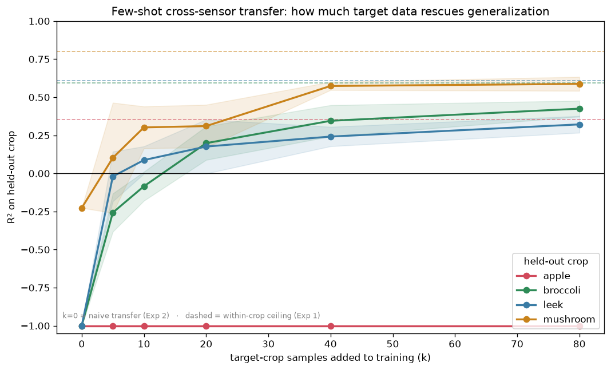
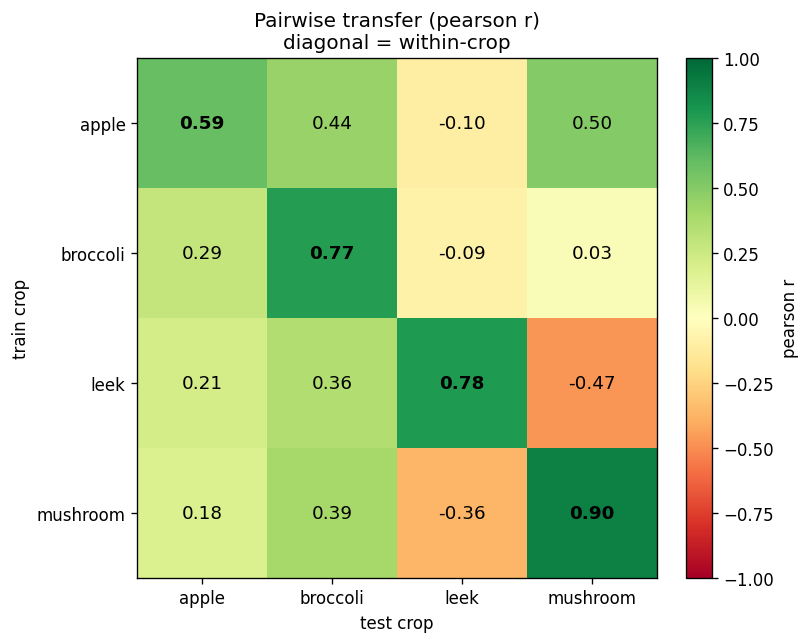
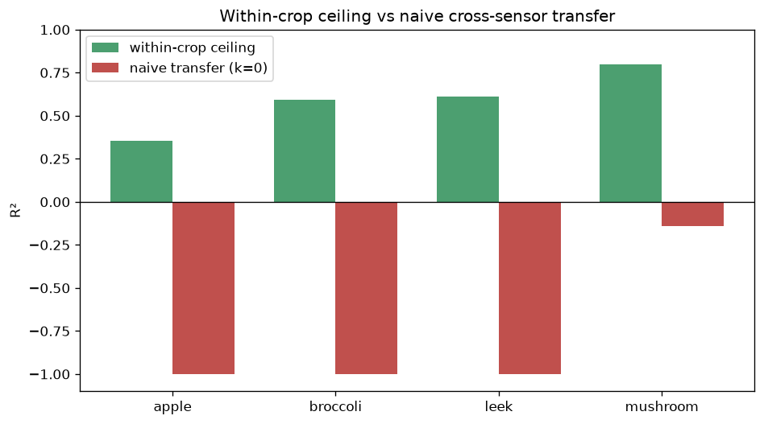

# SpectroFood — Dry Matter Estimation & Cross-Sensor Generalization

<p align="center">
  
</p>

<p align="center">
  <em>Naive transfer fails (k=0); adding a few target-crop samples rescues 3 of 4 crops.</em>
</p>

Predicting **dry matter content** in four food crops (**apple, broccoli, leek, mushroom**) from hyperspectral data, and testing whether a single model can **generalize across different sensors and crop domains**.

> **Main finding:** A dry matter model trained on three crops cannot predict a fourth unseen crop (zero-shot transfer fails), but adding as few as **5–20 samples** from the target crop restores useful prediction for three of four crops. Apple remains challenging due to its intrinsically weak dry-matter signal.

Dataset: **SpectroFood** (Malounas et al., *Data in Brief*, 2024)
https://doi.org/10.1016/j.dib.2024.110040

---

# Headline Results

| Phase                               | Research Question                                                | Main Result                                                                                                                  |
| ----------------------------------- | ---------------------------------------------------------------- | ---------------------------------------------------------------------------------------------------------------------------- |
| **Phase 1 – Spectral Baselines**    | Can dry matter be predicted from mean spectra?                   | Yes for leek (R² = 0.91) and mushroom (0.87); weaker for broccoli (0.58) and apple (0.44).                                   |
| **Phase 2 – Cube CNN**              | Do spatial features from hyperspectral cubes improve prediction? | No. Diagnostics showed that spatial information adds little beyond the mean spectrum. A 3D CNN was systematically ruled out. |
| **Phase 3 – Cross-Sensor Transfer** | Can a model generalize to an unseen crop + camera?               | Zero-shot transfer fails (R² < 0). Few-shot adaptation with 5–20 target samples rescues 3 of 4 crops.                        |

---

# Key Figures

## Few-Shot Cross-Sensor Transfer


*Naive transfer fails (k=0); adding a few target-crop samples rescues 3 of 4 crops. Apple remains resistant.*

---

## Pairwise Transfer Structure



*Transfer has structure: strong within-crop performance, leek behaves as a spectral island, and apple is a surprisingly good donor despite being difficult to predict itself.*

---

## Within-Crop Ceiling vs Naive Transfer



*Within-crop performance acts as an upper bound on achievable cross-sensor performance.*

---

# Project Structure

```text
data/
│
├── SpectroFood_dataset.csv
└── cubes/
    ├── Apple.mat
    ├── Broccoli_15.mat
    ├── Leek_1.mat
    └── Mushroom_1.mat

results/
├── metrics_per_category.csv
├── metrics_pooled.csv
├── phase1_benchmark.csv
├── phase2/
│   └── apple_labels.csv
└── phase3/
    ├── exp1_within_crop.csv
    ├── exp1_within_crop_ceiling.csv
    ├── exp2_leave_one_out.csv
    ├── exp3_pairwise.csv
    ├── exp3_pairwise_pearson_matrix.csv
    ├── exp3_pairwise_r2_matrix.csv
    ├── exp_fewshot.csv
    └── plots/
        ├── ceiling_vs_naive.png
        ├── fewshot_recovery.png
        └── pairwise_heatmap.png

src/
├── phase1/
│   └── phase1.ipynb
├── phase2/
│   ├── cube_loader.py
│   ├── cube_mean_probe.py
│   ├── cube_vs_csv.py
│   ├── labels.py
│   ├── model.py
│   ├── normalize.py
│   ├── patches.py
│   ├── preprocessing.py
│   ├── rf_probe.py
│   └── train.py
└── phase3/
    ├── data.py
    ├── exp1_within.py
    ├── exp2_leave_one_out.py
    ├── exp3_pairwise.py
    ├── exp_fewshot.py
    ├── uncertainty.py
    └── phase3.ipynb

PROJECT_REPORT.md
README.md
requirements.txt
```

---

# Data

The original hyperspectral cubes are intentionally **not committed** because they are several gigabytes in size.

Download the SpectroFood dataset and place files as:

```text
data/
├── SpectroFood_dataset.csv
└── cubes/
    ├── Apple.mat
    ├── Broccoli_15.mat
    ├── Leek_1.mat
    └── Mushroom_1.mat
```

### Dataset Sources

Mean spectra CSV:

https://zenodo.org/records/8362947

Hyperspectral cubes:

https://zenodo.org/records/10301753

Phase 1 and Phase 3 require only:

```text
data/SpectroFood_dataset.csv
```

Phase 2 additionally requires the `.mat` cubes.

---

# Installation

```bash
pip install -r requirements.txt
```

PyTorch is only required for Phase 2.

---

# Running the Project

Run all commands from the project root.

## Phase 1 — Spectral Baselines

Open:

```text
src/phase1/phase1.ipynb
```

and execute all cells.

---

## Phase 3 — Cross-Sensor Generalization

```bash
python src/phase3/exp1_within.py        --csv data/SpectroFood_dataset.csv --out results/phase3/exp1_within_crop.csv

python src/phase3/exp2_leave_one_out.py --csv data/SpectroFood_dataset.csv --out results/phase3/exp2_leave_one_out.csv

python src/phase3/exp_fewshot.py        --csv data/SpectroFood_dataset.csv --out results/phase3/exp_fewshot.csv --seeds 5 --model RF

python src/phase3/exp3_pairwise.py      --csv data/SpectroFood_dataset.csv --out results/phase3/exp3_pairwise.csv

python src/phase3/uncertainty.py        --csv data/SpectroFood_dataset.csv --out results/phase3/exp2_with_ci.csv
```

Then open:

```text
src/phase3/phase3.ipynb
```

to generate the figures and summary analyses.

---

## Phase 2 — Cube CNN (Optional)

Reproduces the negative result showing that spatial information does not improve dry-matter estimation.

```bash
python src/phase2/labels.py \
  --mat data/cubes/Apple.mat \
  --csv data/SpectroFood_dataset.csv \
  --prefix A \
  --out results/phase2/apple_labels.csv

python src/phase2/patches.py \
  --mat data/cubes/Apple.mat \
  --labels results/phase2/apple_labels.csv \
  --prefix A \
  --max-per-cube 100 \
  --out results/phase2/apple_patches.npz

python src/phase2/train.py \
  --data results/phase2/apple_patches.npz \
  --model 3d \
  --folds 5 \
  --epochs 25
```

Additional diagnostics:

```text
rf_probe.py
cube_mean_probe.py
cube_vs_csv.py
```

---

# Methodology Notes

### No Data Leakage

* Group-aware cross-validation by crop in Phase 3.
* Group-aware cross-validation by cube in Phase 2.
* All preprocessing is fit only on training folds.

### Uncertainty Estimation

* Bootstrap confidence intervals for held-out evaluations.
* Fold-to-fold variability reporting for cross-validation experiments.

### Honest Negative Results

The conclusion that a CNN does not help was reached through a documented diagnostic chain rather than an abandoned experiment.

### Cross-Sensor Evaluation

The project explicitly evaluates transfer across crop-camera domains instead of relying on random train/test splits.

---

# Tech Stack

### Programming

* Python 3

### Data & Numerical Computing

* NumPy
* pandas
* SciPy

### Machine Learning

* scikit-learn

  * Partial Least Squares (PLS)
  * Ridge Regression
  * Random Forest
  * Pipelines
  * GroupKFold
* XGBoost

### Deep Learning

* PyTorch
* 1D CNNs
* 3D CNNs

### Hyperspectral Processing

* Standard Normal Variate (SNV)
* Savitzky–Golay derivatives
* Otsu foreground segmentation
* `.mat` cube processing (`scipy.io`)

### Visualization

* Matplotlib

### Experimental Methods

* Per-crop spectral regression
* Leave-one-crop-out transfer learning
* Few-shot adaptation
* Bootstrap confidence intervals
* Group-aware cross-validation

---

# Report

A complete technical write-up is available in:

```text
PROJECT_REPORT.md
```

The report documents the full experimental pipeline, diagnostic reasoning, limitations, and future work.

---

# Citation

If you use the dataset, please cite:

> Malounas et al. (2024). SpectroFood: A benchmark hyperspectral dataset for dry matter estimation in food crops. *Data in Brief*.
